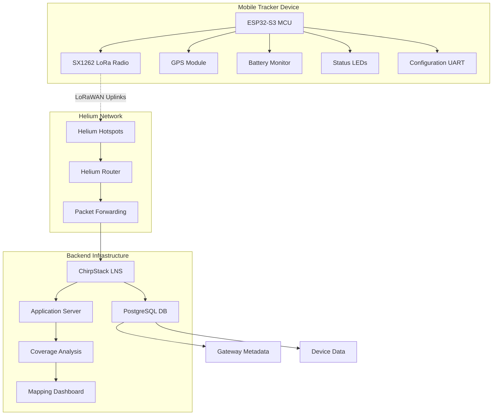
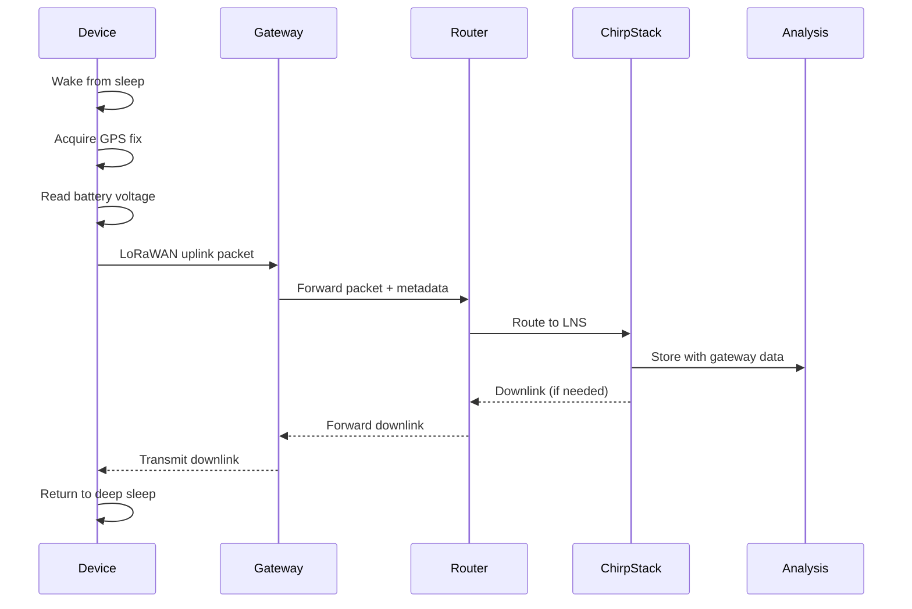

# System Architecture - Helium Gateway Mapper

## High-Level Architecture



## Component Details

### Tracker Device Components

#### ESP32-S3 Microcontroller
- **Role**: Main processing unit, LoRaWAN stack, power management
- **Features**: Dual-core, built-in WiFi/BLE, deep sleep capability
- **Power**: 3.3V operation, ultra-low power deep sleep (<10µA)
- **Storage**: 4MB flash, 512KB SRAM, NVS for configuration

#### SX1262 LoRa Transceiver  
- **Role**: Physical layer LoRa radio communication
- **Frequency**: US915 band (902-928 MHz)
- **Power**: +22 dBm max output (user configurable)
- **Sensitivity**: Down to -147 dBm (SF12, 125kHz BW)
- **Interface**: SPI communication with ESP32

#### GPS Module
- **Role**: Location acquisition for mapping
- **Type**: UART-based GPS receiver
- **Accuracy**: 2.5m CEP typical
- **Cold Start**: <30 seconds typical
- **Power**: Controlled via VEXT pin for battery optimization

### Network Infrastructure

#### Helium Hotspots (Gateways)
- **Role**: LoRaWAN packet reception and forwarding
- **Coverage**: Variable range (1-10km typical)
- **Backhaul**: Internet connection (WiFi/Ethernet/Cellular)
- **Protocol**: LoRaWAN gateway protocol to Helium Router

#### Helium Router/Network Server
- **Role**: Packet routing, device management, billing
- **Function**: Forwards packets to configured LNS endpoints
- **Integration**: Routes packets to ChirpStack via HTTP/gRPC
- **Metadata**: Adds gateway location, signal quality data

#### ChirpStack Network Server
- **Role**: LoRaWAN network server functionality
- **Features**: Device management, session handling, ADR
- **Database**: PostgreSQL for device and gateway data
- **Integration**: APIs for data extraction and analysis

## Data Flow Architecture

### Uplink Data Flow



### Data Processing Pipeline

1. **Device Side Processing**
   - GPS coordinate acquisition
   - Battery voltage measurement  
   - Payload construction and encoding
   - LoRaWAN packet transmission

2. **Network Side Processing**
   - Gateway reception and RSSI/SNR measurement
   - Packet forwarding with metadata
   - Routing to appropriate network server
   - Device session management

3. **Backend Processing**
   - Packet decoding and validation
   - Location data extraction
   - Gateway metadata correlation
   - Coverage map generation

## Component Interfaces

### Device Internal Interfaces

| Interface | Components | Protocol | Purpose |
|-----------|------------|----------|---------|
| SPI | ESP32 ↔ SX1262 | SPI @ 8MHz | LoRa radio control |
| UART | ESP32 ↔ GPS | Serial @ 9600 | GPS data |
| I2C | ESP32 ↔ Sensors | I2C | Environmental sensors (optional) |
| GPIO | ESP32 ↔ Control | Digital | LED control, power switching |
| ADC | ESP32 ↔ Battery | Analog | Battery voltage monitoring |

### Network Interfaces

| Interface | Components | Protocol | Purpose |
|-----------|------------|----------|---------|
| LoRaWAN | Device ↔ Gateway | LoRaWAN 1.0.3 | Wireless communication |
| UDP | Gateway ↔ Router | Semtech UDP | Packet forwarding |
| HTTP/gRPC | Router ↔ ChirpStack | REST/gRPC | LNS integration |
| SQL | ChirpStack ↔ Database | PostgreSQL | Data persistence |

## Module Boundaries

### Device Software Modules

```
┌─────────────────┐
│   Application   │  ← GPS tracking, payload formatting
├─────────────────┤
│   LoRaWAN       │  ← MCCI LoRaWAN library, OTAA, session mgmt
├─────────────────┤
│   Hardware      │  ← GPIO, SPI, UART, power management
├─────────────────┤
│   RTOS/Arduino  │  ← ESP32 FreeRTOS, Arduino framework
└─────────────────┘
```

### Backend Software Modules

```
┌─────────────────┐
│   Dashboard     │  ← Web UI, coverage visualization
├─────────────────┤
│   Analysis      │  ← Coverage algorithms, reporting
├─────────────────┤
│   ChirpStack    │  ← Network server, device management
├─────────────────┤
│   Integration   │  ← Helium connector, data adapters
├─────────────────┤
│   Database      │  ← PostgreSQL, time-series data
└─────────────────┘
```

## Deployment Architecture

### Physical Deployment

```
┌─────────────────┐
│ Tracker Device  │
│ (Mobile)        │  
└─────────────────┘
         │ LoRaWAN
         ▼
┌─────────────────┐
│ Helium Hotspots │ 
│ (Distributed)   │
└─────────────────┘
         │ Internet
         ▼
┌─────────────────┐
│ Cloud Server    │
│ (ChirpStack)    │
└─────────────────┘
```

### Network Topology

- **Star Topology**: Device connects to multiple gateways simultaneously
- **Multi-Gateway**: Packet received by multiple gateways for diversity
- **Internet Backhaul**: All gateways connected to central router via internet
- **Redundancy**: Multiple gateways provide coverage redundancy

## Security Architecture

### Device Security
- **OTAA Authentication**: Cryptographic device authentication
- **AES Encryption**: Payload encryption with session keys
- **Replay Protection**: Frame counters prevent replay attacks
- **Key Management**: Secure key storage in device NVS

### Network Security  
- **Gateway Authentication**: Gateways authenticated to Helium network
- **Transport Encryption**: TLS for backend communications
- **Access Control**: API authentication for data access
- **Audit Logging**: All operations logged for security analysis

## Scalability Considerations

### Device Scalability
- **Multiple Devices**: Support for fleet of tracking devices
- **Unique DevEUIs**: Each device has unique identifier
- **Session Isolation**: Independent LoRaWAN sessions per device
- **Configuration Management**: Remote configuration updates

### Network Scalability
- **Gateway Density**: Supports dense gateway deployments
- **Traffic Handling**: ChirpStack scales to thousands of devices
- **Database Optimization**: Time-series optimization for location data
- **API Rate Limiting**: Prevents backend overload 